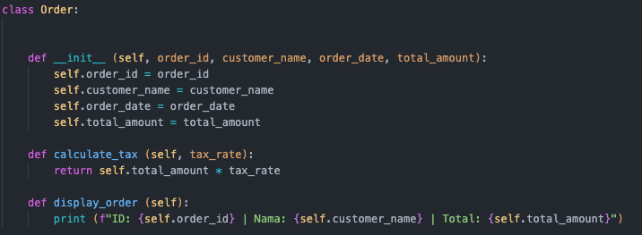
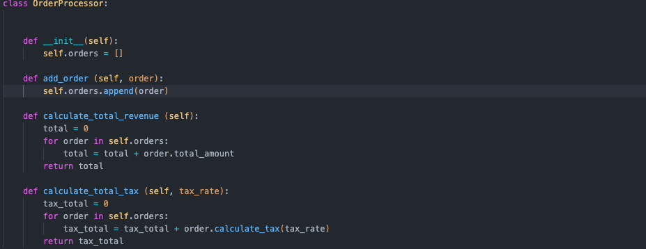
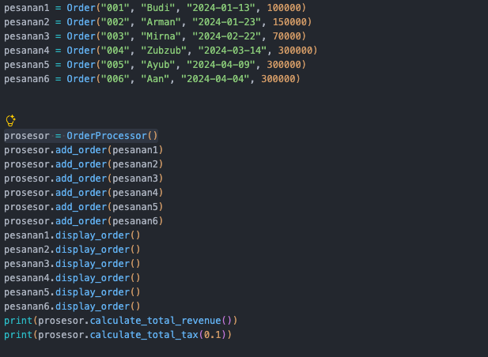
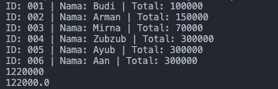

Eksplorasi Hard Skill Data Engineer Python Programming

Jadi yang digunakan pada push method ini menggunakan object oriented programming dimana konsepnya berfokus pada objek. 
Lalu objek ini mempunyai atribut dan method.
Attribut ini bisa terdiri dari variabel yang akan membantu menyimpan data, dapat juga terdiri dari cici ciri dari suatu objek.
Misalkan objeknya pakaian atributnya (warna, merk, jenis pakaian, dan masih banyak lagi)
Lalu ada method dimana berfungsi sebagai pendefinisian dari classnya biasanya ada proses yang dilakukan

Program saya ini terdiri dari 2 class ada class Order dan OrderProcessor
- Class Order
 Ini terdiri dari parameter yang akan diisi oleh object diantaranya order_id, customer_name, order_date, total_amount, tax_rate

 Di class order ini ada method calculate tax dan display order fungsinya yaitu untuk menghitung ppajak yang didapat pada setiap transaksi dan menampilkannya

 

 - Class OrderProcessor
 Terdiri dari pparameter order dan tax_rate yang akan diisi oleh object

 Di class order ini akan membuat list pada self.orders yang diisi oleh parameter order yang selanjutnya akan dihitung melalui method total keuntungan calculate_total_revenue dan total pajak calculate_total_tax yang didapat, menggunakan looping 
 
 pada calculate_total_tax memanggil method calculate_tax pada class order maksudnya mengambil object Order yang sedang dipegang oleh order, lalu jalankan method calculate_tax() milik object tersebut.

 

 Enkapsulasi diterapkan dengan membungkus data dan method yang berkaitan ke dalam class. Pada class Order, data pesanan seperti order_id, customer_name, order_date, dan total_amount disimpan sebagai atribut object, sedangkan calculate_tax() dan display_order() digunakan untuk mengolah dan menampilkan data tersebut. Class OrderProcessor juga menerapkan enkapsulasi dengan menyimpan kumpulan object Order dalam self.orders serta menyediakan method untuk menambahkan order dan menghitung total revenue maupun pajak.

Lalu program diuji dengan memasukkan data disini saya membuat variabel atau objek dengan nama pesanan1 - pesanan6

Setelah itu membuat object dari class dengan melakukan prosesor = OrderProcessor()

setelah itu memanggil method pengisian data menjadi list dengan method add_order

lalu pesanan di tampilkan juga dihitung total pendapatan dan pajaknya

Hasil yang didapat seperti ini

